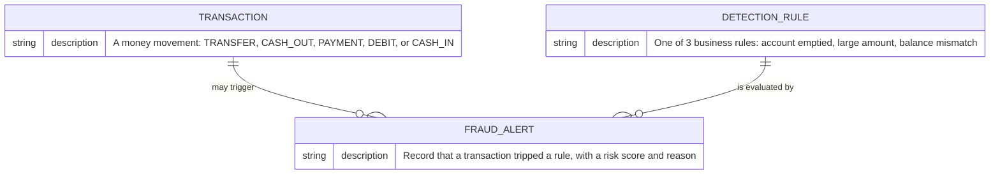
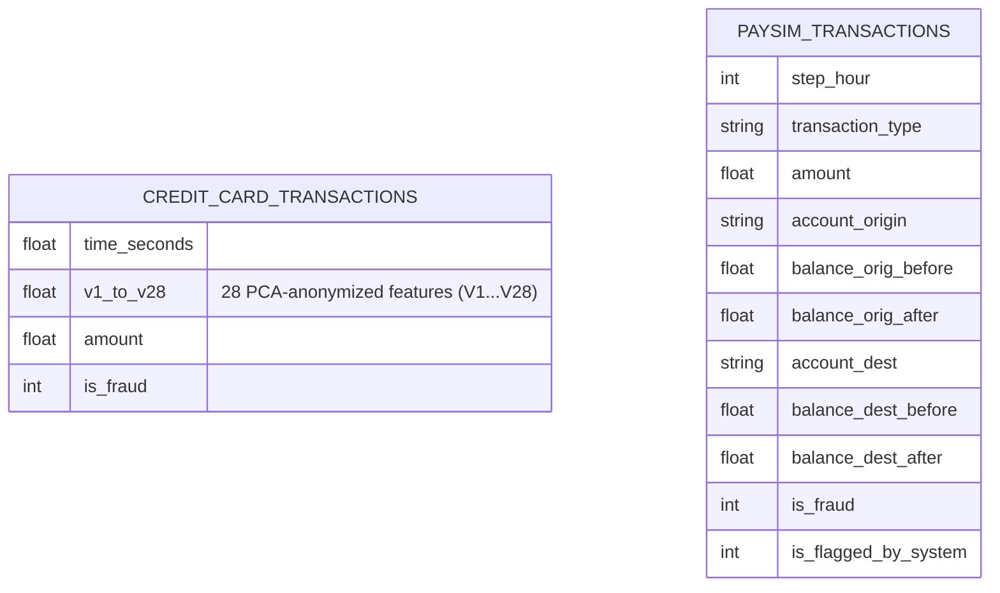
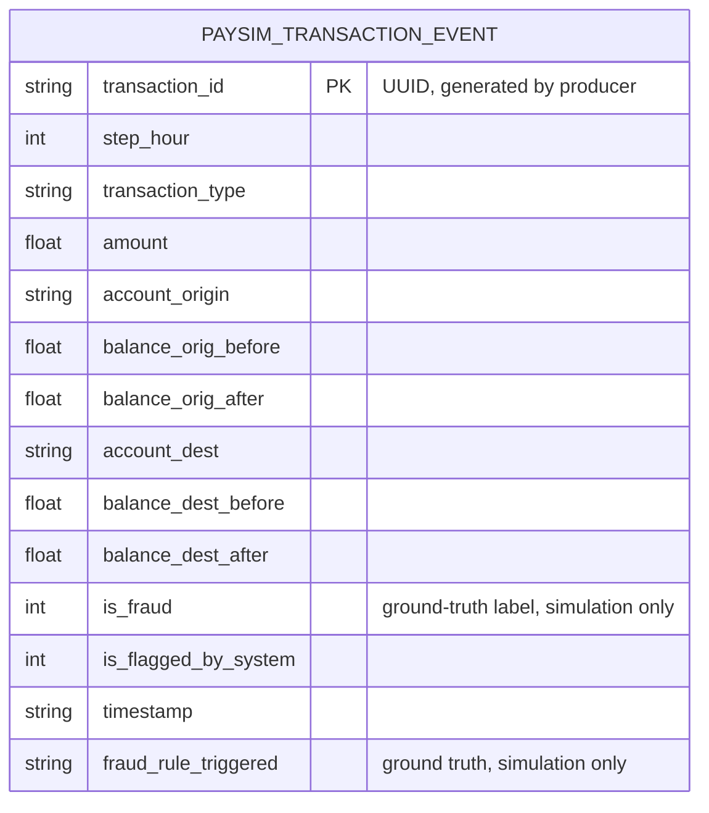
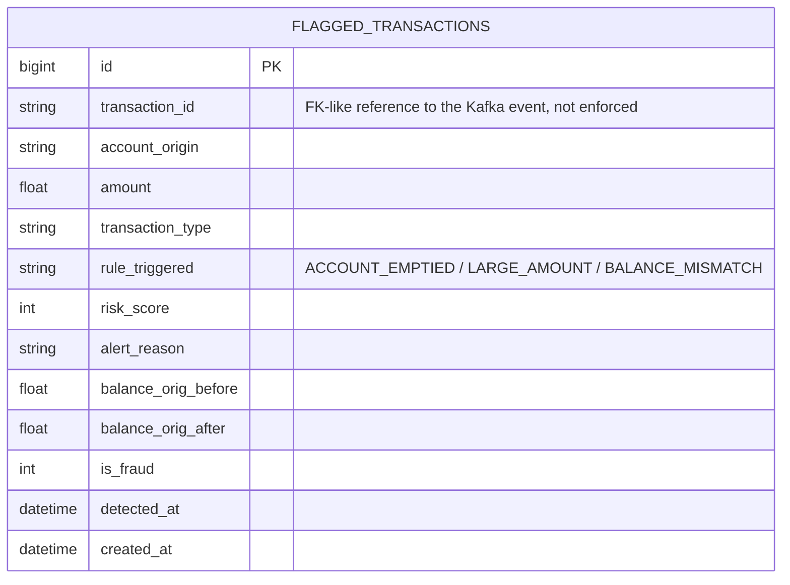
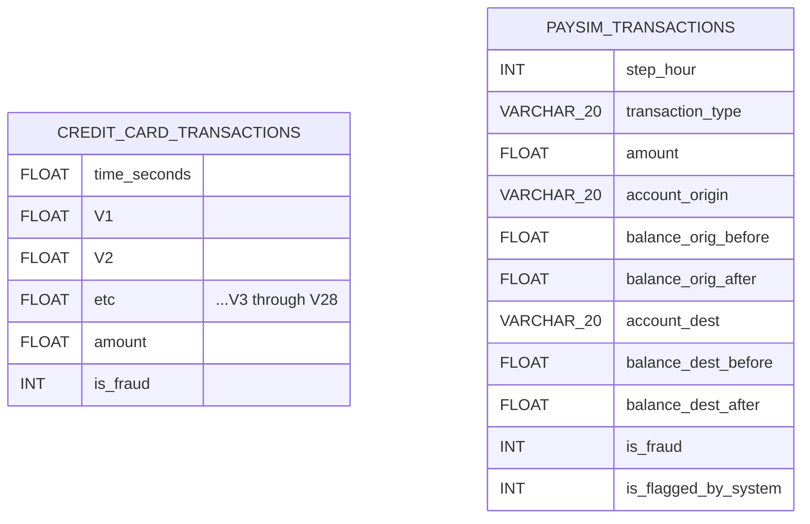
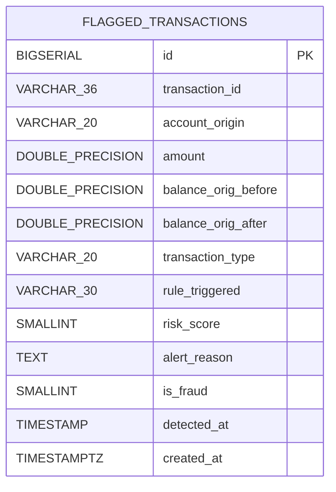

# Data Model — Fraud Detection & AML Transaction Monitoring

This document reconstructs the real data model behind the project from the
actual schema DDL, Spark job, and Kafka producer in this repo. It is written
as three standard modeling layers (conceptual → logical → physical) plus the
design rationale a data governance/modeling review would ask for.

**Source of truth for every diagram below:**
- `fraud_detection.sql` — Snowflake `CREATE TABLE` statements (batch layer)
- `producer.py` — `PaySimTransaction` dataclass (Kafka message schema)
- `fraud_detector.py` — `TRANSACTION_SCHEMA` and the exact columns selected
  in `add_alert_columns()` (Postgres sink)
- `storage/init.sql` — new in this update; see "Gap found and closed" below

---

## 1. Architecture reality check

This is **not** one normalized relational database. It is two independent
systems that never join to each other at the data layer:

| Layer | System | Role |
|---|---|---|
| Batch analytics | Snowflake | One-time historical analysis of two Kaggle datasets to *design* the detection rules |
| Real-time operational | Kafka → PySpark → PostgreSQL | *Runs* those same 3 rules continuously against a simulated live feed |

The two layers share detection logic (the same three CASE-WHEN rules appear
in both `fraud_detection.sql` and `fraud_detector.py`), but they do **not**
share a database, a schema, or a key. That's a real, load-bearing design
characteristic, not an oversight — see Section 4.

---

## 2. Conceptual ER diagram

Business-level entities only, no columns, no vendor types.

---

## 3. Logical ER diagrams

Real attributes, generic types, no vendor-specific syntax. Shown as three
separate diagrams because they are three separate physical stores with **no
enforced foreign key across them** (see Section 4 for why).

### 3a. Snowflake batch layer (`fraud_detection.sql`)

No relationship line connects these two tables. They come from two unrelated
Kaggle datasets (ULB credit card fraud vs. PaySim mobile money) loaded
independently via the same Snowflake stage. Neither table has a
`transaction_id` rows are anonymous/positional. This matters: it means the
batch layer cannot be joined row-for-row to anything in the operational layer.

### 3b. Kafka streaming schema (`producer.py` / `fraud_detector.py`)

This is a message schema (JSON over Kafka), not a table  `transaction_id`
exists here for the first time in the pipeline. This is the schema
`fraud_detector.py`'s `TRANSACTION_SCHEMA` deserializes against.

### 3c. Postgres operational sink (`storage/init.sql`, new)

`FLAGGED_TRANSACTIONS` only contains transactions that tripped a rule it is
an **exception log**, not a full transaction ledger.

---

## 4. Physical ER diagram (real DDL types)

### Snowflake (already existed, verbatim from `fraud_detection.sql`)

No `PRIMARY KEY` is declared on either table (Snowflake does not enforce PK/FK
constraints even when declared, so the original author correctly omitted
them for pure-analytics staging tables this is a legitimate, not lazy,
choice, see 5.2).

### PostgreSQL — `flagged_transactions` (new: `storage/init.sql`)

`UNIQUE (transaction_id, rule_triggered)` enforced at the constraint level
(not shown in Mermaid's ER notation, documented in the DDL comments).

---

## 5. Modeling rationale — real decisions and tradeoffs

### 5.1 Why two flat Snowflake tables instead of a normalized schema
`CREDIT_CARD_TRANSACTIONS` and `PAYSIM_TRANSACTIONS` are 1:1 mirrors of their
source Kaggle CSVs, loaded through a single `FRAUD_STAGE` (`fraud_detection.sql`).
This is deliberate, standard staging-layer practice: the tables exist to be
queried directly by analytical SQL (window functions, CTEs), not to serve an
application. Normalizing them (e.g., splitting `PAYSIM_TRANSACTIONS` into an
`ACCOUNTS` table plus a `TRANSACTIONS` table referencing it) would add join
overhead for zero analytical benefit, since every query in this project
scans the whole table anyway (`GROUP BY transaction_type`, `NTILE(100) OVER
(...)`). Denormalized-by-design is the right call here, not a shortcut.

### 5.2 Why there's no foreign key between the batch and streaming layers
This is the most important real finding from reconstructing this model: the
Snowflake batch tables have **no `transaction_id` column at all** —
rows are positional/anonymous, matching the source Kaggle files. The
streaming layer invents `transaction_id` for the first time in `producer.py`.
That means the historical fraud analysis (Snowflake) and the live alert feed
(Postgres) are **not conformed** — you cannot join a specific flagged
real-time alert back to a specific historical training row. In a real
governance review this would be flagged as a data integration gap: if this
system were to go from portfolio project to production, introducing a shared
conformed transaction key across both layers would be the first
recommendation.

### 5.3 Why Postgres stores only flagged transactions, not every transaction
`flagged_transactions` is an exception log by design. The full transaction
stream is never persisted relationally it exists only transiently in the
Kafka topic (`KAFKA_LOG_RETENTION_HOURS: 168` in `docker-compose.yml`, i.e. 7
days). This keeps the operational store small and fast for alerting/dashboard
queries, at the cost of losing the ability to audit non-flagged transactions
past 7 days. That's a legitimate operational tradeoff (alerting speed vs.
audit completeness) worth naming explicitly rather than leaving implicit.

### 5.4 Gap found and closed: `storage/init.sql` didn't exist
Both the README and `docker-compose.yml` reference `storage/init.sql` as the
Postgres schema, and describe a `UNIQUE(transaction_id, rule_triggered)`
constraint for idempotent writes. Neither the file nor the constraint existed
in the committed repo `fraud_detector.py` was writing to `flagged_transactions`
via plain Spark JDBC append with no DDL behind it at all. `storage/init.sql`
(added in this update) defines the real table with a surrogate `BIGSERIAL`
primary key (chosen because Spark's JDBC writer only inserts the columns
present in the DataFrame, so it never needs to know about `id`), the intended
`UNIQUE` constraint, and two indexes matching the query patterns already
described in the README (`GROUP BY rule_triggered`, time-windowed lookups).

### 5.5 Known gap this does *not* close
Adding the `UNIQUE` constraint restores the schema's intent, but
`fraud_detector.py`'s `write_batch()` still does a plain
`.write.format("jdbc").mode("append")` not an upsert. As written today, a
redelivered Kafka message (which Structured Streaming can produce under
at-least-once semantics) will now cause a constraint violation and fail the
batch, rather than silently deduplicating. Making the constraint actually
useful would mean rewriting `write_batch()` to use
`INSERT ... ON CONFLICT (transaction_id, rule_triggered) DO NOTHING` via
`foreachPartition` + `psycopg2`, since Spark's built-in JDBC writer has no
native upsert mode. This is flagged here rather than silently fixed, since it
is a real code change, not a schema change good candidate for the "new
governance-flavored work" phase (dbt tests or a documented DQ backlog item).

---
